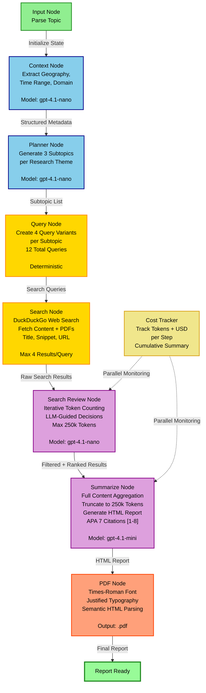

# Research Report Generation Pipeline

## Detailed Mermaid Diagram

```mermaid
graph TD
    A["Input Node<br/>Parse Topic"] -->|Initialize State| B
    
    B["Context Node<br/>Extract Geography,<br/>Time Range, Domain<br/><br/>Model: gpt-4.1-nano"] -->|Structured Metadata| C
    
    C["Planner Node<br/>Generate 3 Subtopics<br/>per Research Theme<br/><br/>Model: gpt-4.1-nano"] -->|Subtopic List| D
    
    D["Query Node<br/>Create 4 Query Variants<br/>per Subtopic<br/>12 Total Queries<br/><br/>Deterministic"] -->|Search Queries| E
    
    E["Search Node<br/>DuckDuckGo Web Search<br/>Fetch Content + PDFs<br/>Title, Snippet, URL<br/><br/>Max 4 Results/Query"] -->|Raw Search Results| F
    
    F["Search Review Node<br/>Iterative Token Counting<br/>LLM-Guided Decisions<br/>Max 250k Tokens<br/><br/>Model: gpt-4.1-nano"] -->|Filtered + Ranked Results| G
    
    G["Summarize Node<br/>Full Content Aggregation<br/>Truncate to 250k Tokens<br/>Generate HTML Report<br/>APA 7 Citations [1-8]<br/><br/>Model: gpt-4.1-mini"] -->|HTML Report| H
    
    H["PDF Node<br/>Times-Roman Font<br/>Justified Typography<br/>Semantic HTML Parsing<br/><br/>Output: .pdf"] -->|Final Report|I["Report Ready"]
    
    J["Cost Tracker<br/>Track Tokens + USD<br/>per Step<br/>Cumulative Summary"] -.->|Parallel Monitoring| F
    J -.->|Parallel Monitoring| G
    
    style A fill:#90EE90,stroke:#228B22,stroke-width:2px,color:#000
    style B fill:#87CEEB,stroke:#00008B,stroke-width:2px,color:#000
    style C fill:#87CEEB,stroke:#00008B,stroke-width:2px,color:#000
    style D fill:#FFD700,stroke:#FF8C00,stroke-width:2px,color:#000
    style E fill:#FFD700,stroke:#FF8C00,stroke-width:2px,color:#000
    style F fill:#DDA0DD,stroke:#8B008B,stroke-width:2px,color:#000
    style G fill:#DDA0DD,stroke:#8B008B,stroke-width:2px,color:#000
    style H fill:#FFA07A,stroke:#FF4500,stroke-width:2px,color:#000
    style I fill:#98FB98,stroke:#228B22,stroke-width:3px,color:#000
    style J fill:#F0E68C,stroke:#DAA520,stroke-width:2px,color:#000

```

