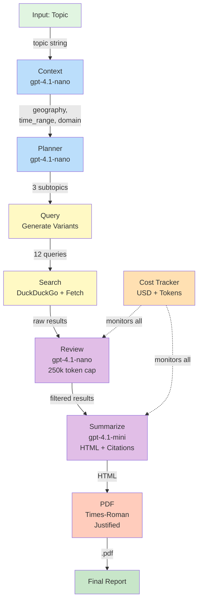

# Research Report Generation Pipeline (Simplified)

```mermaid
graph TD
    INPUT["Input: Topic"] 
        INPUT -->|topic string| CONTEXT["Context<br/>gpt-4.1-nano"]
            
                CONTEXT -->|geography,<br/>time_range, domain| PLANNER["Planner<br/>gpt-4.1-nano"]
                    
                        PLANNER -->|3 subtopics| QUERY["Query<br/>Generate Variants"]
                            
                                QUERY -->|12 queries| SEARCH["Search<br/>DuckDuckGo + Fetch"]
                                    
                                        SEARCH -->|raw results| REVIEW["Review<br/>gpt-4.1-nano<br/>250k token cap"]
                                            
                                                REVIEW -->|filtered results| SUMMARIZE["Summarize<br/>gpt-4.1-mini<br/>HTML + Citations"]
                                                    
                                                        SUMMARIZE -->|HTML| PDF["PDF<br/>Times-Roman<br/>Justified"]
                                                            
                                                                PDF -->|.pdf| OUTPUT["Final Report"]
                                                                    
                                                                        COST["Cost Tracker<br/>USD + Tokens"] -.->|monitors all| REVIEW
                                                                            COST -.->|monitors all| SUMMARIZE
                                                                                
                                                                                    style INPUT fill:#e1f5e1
                                                                                        style CONTEXT fill:#bbdefb
                                                                                            style PLANNER fill:#bbdefb
                                                                                                style QUERY fill:#fff9c4
                                                                                                    style SEARCH fill:#fff9c4
                                                                                                        style REVIEW fill:#e1bee7
                                                                                                            style SUMMARIZE fill:#e1bee7
                                                                                                                style PDF fill:#ffccbc
                                                                                                                    style OUTPUT fill:#c8e6c9
                                                                                                                        style COST fill:#ffe0b2
                                                                                                                        
```

